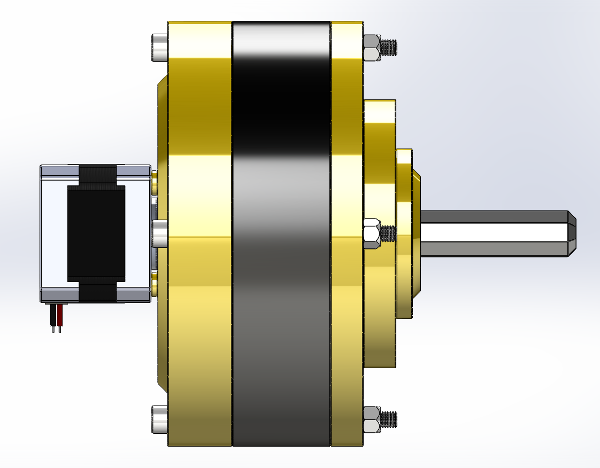
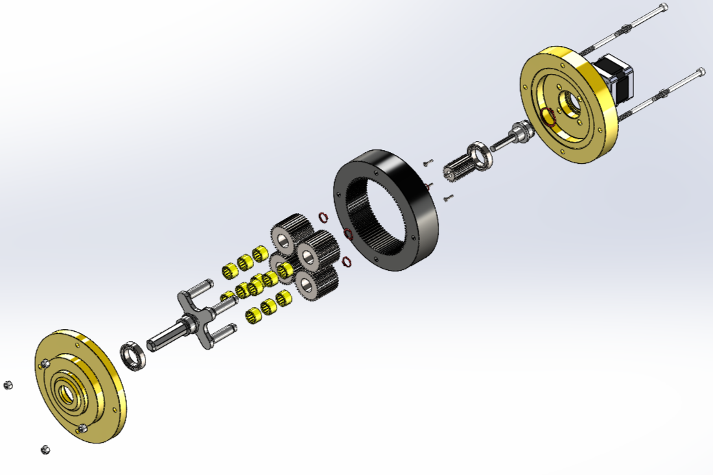
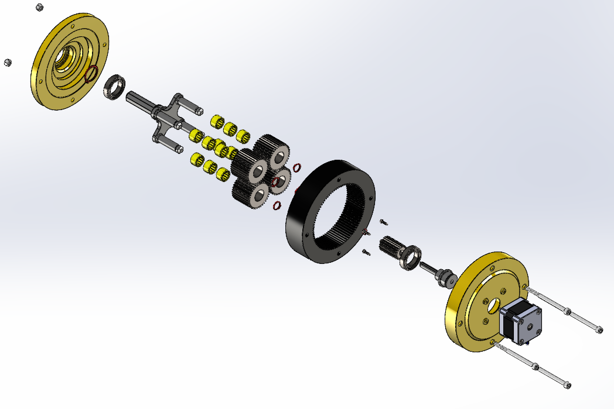
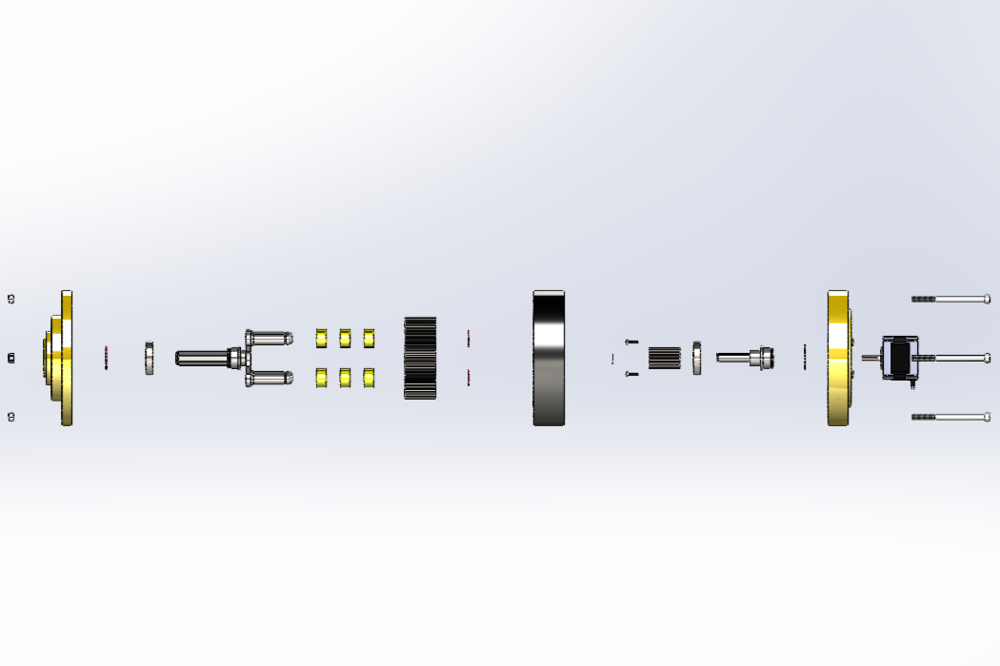
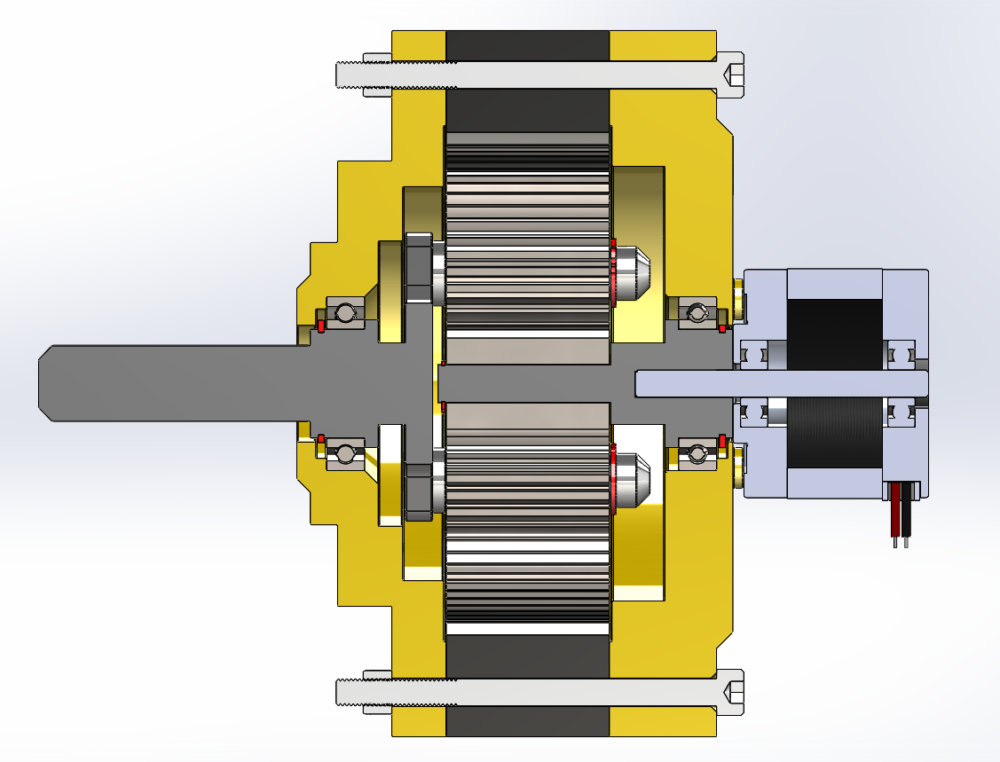
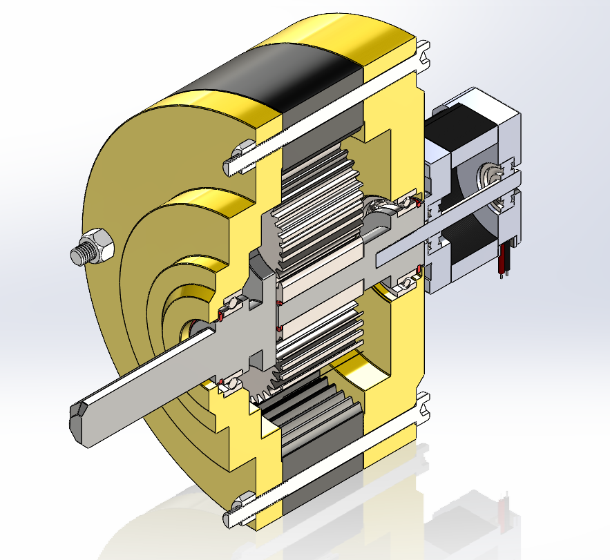

# Planetary Gear System Design (SolidWorks)

## 📌 Overview

This project presents the design of a planetary gear system developed in SolidWorks. The goal was to model a transmission system and validate its motion and gear ratio through simulation.

<p align="center">
  
</p>

## 📂 Project Structure

```
Planetary-Gear-System-Design-SolidWorks/ 
│ 
├── Media/ # screenshots, animations 
├── SolidWorks Files/ # .SLDPRT and .SLDASM files 
└── README.md
```

## ⚙️ Key Features

* Complete 3D CAD modeling of sun, planet, ring gears, and other supporting parts.
* Assembly of a functional planetary gear train
* Verified gear ratio through SolidWorks motion simulation
* Parametric design approach for easy modification
* Smooth gear meshing with no interference

## 📊 Gear Design & Engineering Calculations

### 1. Design Objective

To design a planetary gear system achieving a target gear reduction of:

Target Gear Ratio (R) = 6 : 1

### 2. Initial Parameters

* Module (m) = 1 mm (constant for all gears)
* Number of planet gears = 4
* Compact design constraint for efficient packaging

### 3. Ring Gear Design

* Selected outer diameter:
  D₀ = 92 mm

* Pitch diameter calculation:
  D = D₀ − 2m = 92 − 2(1) = 90 mm

* Number of teeth on ring gear:
  Nr = D / m = 90 / 1 = 90 teeth

### 4. Sun Gear Calculation

Using planetary gear relation:

R = 1 + (Nr / Ns)

Rearranging:

Ns = Nr / (R − 1)

Substituting values:

Ns = 90 / (6 − 1) = 18 teeth

### 5. Planet Gear Calculation

Planet gear teeth:

Np = (Nr − Ns) / 2

Np = (90 − 18) / 2 = 36 teeth

### 6. Assembly Constraint Check

For proper spacing of planet gears:

(Nr − Ns) / Number of Planets must be an integer

(90 − 18) / 4 = 18 ✔

✅ Condition satisfied

### 7. Final Gear Parameters

* Ring Gear (Nr) = 90 teeth
* Sun Gear (Ns) = 18 teeth
* Planet Gear (Np) = 36 teeth
* Number of Planets = 4

### 8. Final Gear Ratio

Gear Ratio = 1 + (Nr / Ns)
= 1 + (90 / 18)
= 6 : 1

## 🖼️ Preview

### 🔧 Exploded View

<p align="center">
  
  
  
</p>

### 🔍 Cross Section

<p align="center">
  
  
</p>

### 🎥 Motion Simulation

<p align="center">
  
</p>

## ✅ Results

* Motion study performed in SolidWorks to verify rotational behavior
* Smooth transmission between gears with correct constraints
* No collision or interference detected
* Output rotation matches calculated gear ratio (6:1)

## 📈 What I Learned

- Practical implementation of planetary gear kinematics  
- Translating theoretical gear equations into CAD models  
- Importance of assembly constraints in motion behavior  
- Validation of mechanical systems using simulation tools  

## 📌 Notes

This project focuses on the mechanical design and validation of a planetary gear system. Future improvements may include:

* Helical gear implementation
* Load and stress analysis (FEA)
* Optimization for real-world manufacturing
